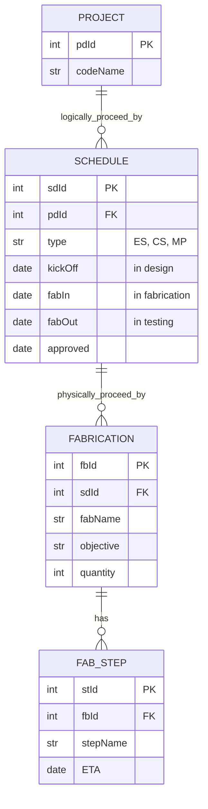

# Fabrication Schedule Planner
- Easily view your product development roadmap

### ERD Diagram
- 프로젝트는 여러 개의 일정을 갖고 진행됨
- 일정의 종류: Engineering Sample, Customer Sample, Mass Production
- 일정의 주요 마일스톤: 킥오프, 제조 시작, 제조 종료, 승인
- 일정은 여러 개의 제조 공정에 투입해 진행
- 제조 공정은 여러 개의 step으로 구성

